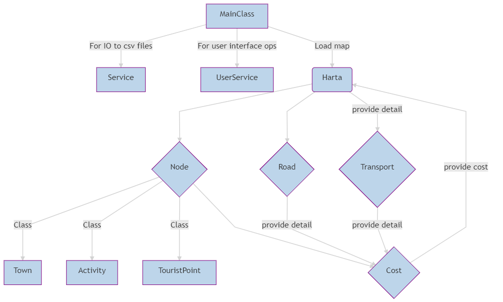

Map Project
---

It is given a map marked by certain nodes(towns to visit or activities to do), with some transporation possibilities.
The result displayed will be the best road from one node to another regarding time, price or distance traveled.
Classes involved:

---

1.**Entities.Node** : Abstract class with: -
   'getIndex' method which gets the index from some town or activity name⋅⋅

---

2.**Entities.Town** : -
    Class to be populated from Services.Main with objects

---

3.**Entities.Activity** : -
    Addition from town and node - has some happiness index which will be used afterwards

4.**Entities.TouristPoint** : -
    Addition from town and node - has some happiness index which will be used afterwards

---

5.**Entities.Transport**: -
    Contains name of transport, and several details of the transportation method
    Has `displayTransport` method which gives a full detail in System.out about itself.
    Has pedestrian and bicycle transportation types already given(lets the user decide wheter to use them in Services.Main)

---

6.**Entities.Road**: -
    Ties towns or activities one to another
    Has method `isPossible` which decides if a certain transportation method is fit for this road
    Has method `getCost` which calculates the Entities.Cost based on a Entities.Road and a certain transportation unit
    Has method 1displayRoad1 which hives a full detail about the road.

---

7.**Entities.Cost**: -
    Instantiable class with more constructors
    Has Method `addCost` which calculates the sum of two costs
    `toString` method overloaded, which gives our description about this object.

---

8.**Entities.CostTime**, **Entities.CostDistance**, **Entities.CostDistance**
    - All implement `Comparator<Entities.Cost>`, will be used in Dijsktra's Algorithm.

---

9.**Entities.Harta** -
    Services.Service class, used for implementing operations for the given network.
    Is Singleton, is instantiated within Services.Main class and has only one instance.
    Has static `ArrayLists` which contain roads, towns and transportations methods.
    Has `addRoad`, `addTown`, `addTransportation` methods, which gives puts in the network another object to use.
    Has `getCost` method, which implements Disjktra's algorithm for the given indexes, or string(i.e gets the best road from some certain town to another)
    Has `getBestTime`, `getBestDistance`, `getBestPay` methods, which use the comparators from Entities.Cost.
    So, the graph minimum distance algorithm is implemented for time, distance, and price within the same code(just changing the given PriorityQueue)
    Has `displayAllBest` which gives the best three ways from a node to another

---

10.**Services.Main** -
    Is split in two functions, one uploads the information to the graph, and the other queries the graph
    
